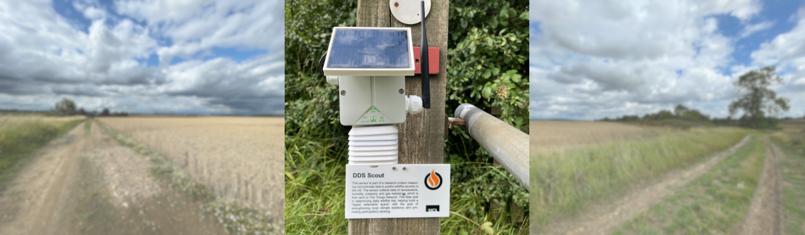

# Firewall Scout: Building a Digital Defensible Space with IoT

## Overview
The Firewall Scout project is a research initiative aimed at enhancing environmental monitoring and fire risk management within the UK's urban-rural interface (URI). This project introduces the concept of a "digital defensible space" - a protective barrier formed by a network of sensors that continuously monitor and analyze environmental variables contributing to fire risk. The goal is to enable precise assessment of potential fire hazards by generating a higher fidelity Fire Severity Index (FSI), thereby strengthening preventive measures and enhancing community resilience.

## Key Features
- **LoRa Connection Regulation:** Advanced LoRaWAN connection management with a smart retry mechanism to mitigate deployments on the edge of connectivity ranges. Energy-saving feature that puts the device in sleep mode if no connection is established.

- **Device Health and Data Transmission:** Comprehensive device health monitoring, including solar panel and battery status.

- **Downlink Messaging Control:** Dynamic behavior adjustment based on received downlink messages, including on-demand data collection feature for immediate response to changing conditions.

## Research Objectives
- Develop a low-cost sensing device to monitor environmental factors contributing to wildfire events.
- Assess the enhancement of wildfire detection and risk modeling in the UK's URI using a low-cost sensor network combined with participatory sensing.

## Technical Details

### Scout Node Design
- **Sensor Selection:** The BME688 sensor was chosen for its ability to measure temperature, humidity, pressure, and gas resistance. It demonstrated superior performance in dynamic conditions.
- **Hardware Components:** The Firewall Scout node operates on an Arduino MKRWAN 1310 with LoRaWAN connectivity. It's powered by a 3.7V 1000mAh rechargeable lithium polymer battery and optimized for ultra-low power usage.
- **Enclosure:** Components are housed in an IP65-rated plastic enclosure, ensuring weatherproof integrity. A custom-designed Stevenson screen model ensures adequate airflow for the sensor while protecting it from UV rays and direct sunlight.

### Arduino Libraries
- **BSEC Library:** Initially used for the BME688 sensor, this library from Bosch provides raw data readings and offers several power modes. However, due to compatibility issues, its use was discontinued.
- **Adafruit Library:** This library was employed for the development of a low-power version of the Scout node.
- **Arduino Low Power Library:** This library puts the microcontroller into deep sleep between duty cycles, drastically reducing power consumption during idle periods.

### Repository Contents
- **Code:** Reproducible code for the Firewall Scout project.
- **Sensor Calibration:** Calibration details for the sensors used.
- **Enclosure Designs:** Custom designs for the device enclosure.
- **Data:** Collected data used in the study.

## Deployment & Data Collection
Three Scout nodes were deployed from July - August, 2023. Two were placed in Fincham, Norfolk County, and one was placed in Stratford in the Greater London area. They were programmed to send data packets over a ten-minute duty cycle via LoRa radio to The Things Network (TTN). Data was collected in an InfluxDB database, hosted on a Raspberry Pi. Dashboards were constructed within InfluxDB and Grafana for data interpretation and visualization.

- **Grafana Snapshot:** [https://snapshots.raintank.io/dashboard/snapshot/0ffG73hmeVHJxysyXjeP0xVosTB2StvZ]
- **Raw Dataset:** [https://drive.google.com/drive/folders/1qIohqHdbCPThrtIFe0_akVGIIpeAW5eb?usp=sharing]

## Conclusion
The Firewall Scout project represents a step forward in the field of IoT-enabled environmental monitoring and fire risk management. By leveraging technology, this research aims to provide a more comprehensive and accurate assessment of fire risks, ultimately contributing to safer and more resilient communities.
